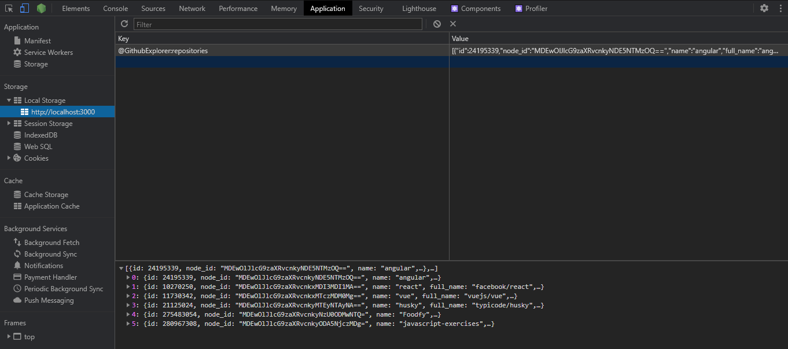

<h1 align='center'>
  
</h1>

<p align='center'>:mag_right: A simple app to explore repositories on Github<p>

# :pushpin: Table of Contents

- [Features](#zap-features)
- [Getting started](#runner-getting-started)
- [Technologies](#hammer_and_wrench-technologies)
- [License](#closed_book-license)

<br>

## :zap: Features

- Explore GitHub repositories
- Show repository details
<br><br>

<p align="center">
  
</p>
<br>

<p align="center">
  
</p>

## :hammer_and_wrench: Technologies

Some of the technologies and tools used:

- [ReactJS](https://reactjs.org/)
- [Typescript](https://www.typescriptlang.org/)
- [Styled-components](https://styled-components.com/)
- [Husky](https://github.com/typicode/husky)
- [Commitizen](https://github.com/commitizen/cz-cli)
- [Lint-staged](https://github.com/okonet/lint-staged)

<br>

## :runner: Getting started

**You need to install [Node](https://nodejs.org/en/) and [Yarn](https://yarnpkg.com/getting-started).**

Follow the steps bellow:

```bash
# Open a terminal and copy this repository with the command
$ git clone https://github.com/Mateussv/github-explorer.git

# Enter the directory with
$ cd github-explorer

# Install dependencies
$ yarn install

# Run the application:
$ yarn start

```

**Important:** The searched repositories are saved in Localstorage. It is possible to clean it in the Devtools of the browser used.
<br><br>
<p></p>

<br>


This project is under the [MIT license](https://github.com/Mateussv/github-explorer/blob/master/LICENSE).
